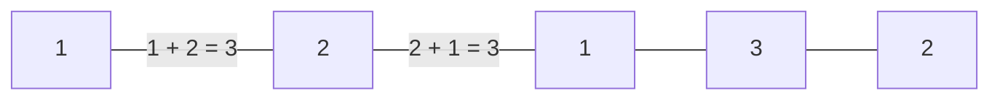
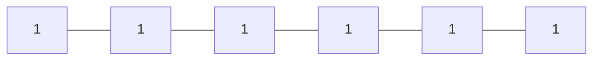

# [Subarray Division](https://www.hackerrank.com/challenges/the-birthday-bar)

- Difficulty: #easy
- Category: #implementation

Two children, Lily and Ron, want to share a chocolate bar. Each of the squares
has an integer on it.

Lily decides to share a contiguous segment of the bar selected such that:

The length of the segment matches Ron's birth month, and,
The sum of the integers on the squares is equal to his birth day.
Determine how many ways she can divide the chocolate.

## Example

$ s = [2, 2, 1, 3, 2] $ \
$ d = 4 $ \
$ m = 2 $

Lily wants to find segments summing to Ron's birth day, $ d = 4 $ with a length
equalling his birth month, $ m = 2 $. In this case, there are two segments
meeting her criteria: $ [2, 2] $ and $ [1, 3] $.

## Function Description

Complete the birthday function in the editor below.

birthday has the following parameter(s):

- int s[n]: the numbers on each of the squares of chocolate
- int d: Ron's birth day
- int m: Ron's birth month

## Returns

- int: the number of ways the bar can be divided

## Input Format

The first line contains an integer , the number of squares in the chocolate
bar.
The second line contains n space-separated integers $ s[i] $, the numbers on the
chocolate squares where $ 0 \leq i < n $.
The third line contains two space-separated integers, d and m, Ron's
birth day and his birth month.

## Constraints

$ 1 \leq n \leq 100 $ \
$ 1 \leq s[i] \leq 5, where (0 \leq i < n) $ \
$ 1 \leq d \leq 31 $ \
$ 1 \leq m \leq 12 $

## Sample Input 0

```text
5
1 2 1 3 2
3 2
```

## Sample Output 0

```text
2
```

## Explanation 0

Lily wants to give Ron $ m = 2 $ squares summing to $ d = 3 $. The following two
segments meet the criteria:



## Sample Input 1

```text
6
1 1 1 1 1 1
3 2
```

## Sample Output 1

```text
0
```

## Explanation 1

Lily only wants to give Ron $ m = 2 $ consecutive squares of chocolate whose
integers sum to $ d = 3 $. There are no possible pieces satisfying these
constraints:



Thus, we print 0 as our answer.

## Sample Input 2

```text
1
4
4 1
```

## Sample Output 2

```text
1
```

## Explanation 2

Lily only wants to give Ron m = 1 square of chocolate with an integer value
of d = 4. Because the only square of chocolate in the bar satisfies this
constraint, we print 1 as our answer.
