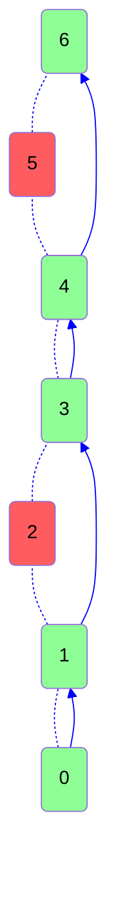
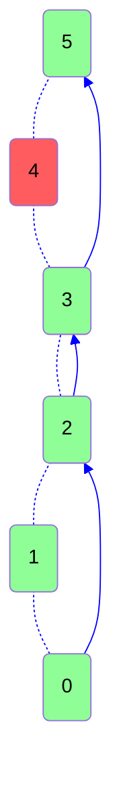

# [Jumping on the Clouds](https://www.hackerrank.com/challenges/jumping-on-the-clouds)

Difficulty: #easy
Category: #implementation

There is a new mobile game that starts with consecutively numbered clouds.
Some of the clouds are thunderheads and others are cumulus. The player can
jump on any cumulus cloud having a number that is equal to the number of the
current cloud plus $ 1 $ or $ 2 $. The player must avoid the thunderheads. Determine
the minimum number of jumps it will take to jump from the starting postion
to the last cloud. It is always possible to win the game.

For each game, you will get an array of clouds numbered $ 0 $ if they are safe
or $ 1 $ if they must be avoided.

## Example

$ c = [0, 1, 0, 0, 0, 1, 0] $

Index the array from 0...6. The number on each cloud is its index in the
list so the player must avoid the clouds at indices 1 and 5. They could
follow these two paths: `0 -> 2 -> 4 -> 6 or 0 -> 2 -> 3 -> 4 -> 6.`
The first path takes $ 3 $ jumps while the second takes $ 4 $. Return $ 3 $.

## Function Description

Complete the jumpingOnClouds function in the editor below.

jumpingOnClouds has the following parameter(s):

* int c[n]: an array of binary integers

## Returns

* int: the minimum number of jumps required

## Input Format

The first line contains an integer n, the total number of clouds.
The second line contains n space-separated binary integers describing
clouds c[i] where 0 <= i < n.

## Constraints

$ 2 <= n < 100 $ \
$ c[i] ∈ {0, 1} $ \
$ c[0] = c[m -1] = 0 $

## Output format

Print the minimum number of jumps needed to win the game.

## Sample Input 0

```text
7
0 0 1 0 0 1 0
```

## Sample Output 0

```text
4
```

## Explanation 0

The player must avoid $ c[2] $ and $ c[5] $. The game can be won with a minimum
of 4 jumps:



## Sample Input 1

```text
6
0 0 0 0 1 0
```

## Sample Output 1

```text
3
```

## Explanation 1

The only thundercloud to avoid is c[4]. The game can be won in 3 jumps:


