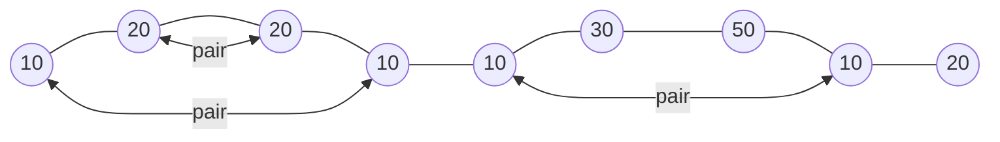

# [Sales by Match](https://www.hackerrank.com/challenges/sock-merchant)

Difficulty: #easy
Category: #implementation

There is a large pile of socks that must be paired by color. Given an array
of integers representing the color of each sock, determine how many pairs
of socks with matching colors there are.

## Example

$ n = 7 $ \
$ ar = [1, 2, 1, 2, 1, 3, 2] $

There is one pair of color $ 1 $ and one of color $ 2 $. There are three odd socks
left, one of each color. The number of pairs is $ 2 $.

## Function Description

Complete the sockMerchant function in the editor below.

sockMerchant has the following parameter(s):

- int n: the number of socks in the pile
- int ar[n]: the colors of each sock

## Returns

- int: the number of pairs

## Input Format

The first line contains an integer n, the number of socks represented in ar.
The second line contains n space-separated integers, ar[i], the colors of
the socks in the pile.

## Constraints

$ 1 \leq n < 100 $ \
$ 1 \leq ar[i] \leq 100 $ where $ 0 \leq i < n $

## Sample Input

```text
STDIN                       Function
-----                       --------
9                           n = 9
10 20 20 10 10 30 50 10 20  ar = [10, 20, 20, 10, 10, 30, 50, 10, 20]
```

Sample Output

```text
3
```

## Explanation



There are three pairs of socks.
